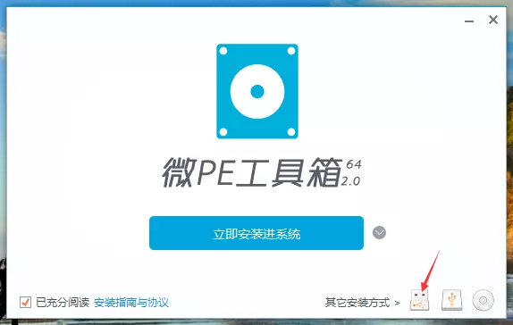
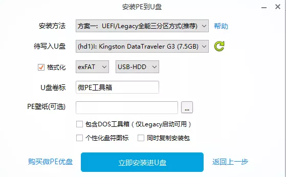
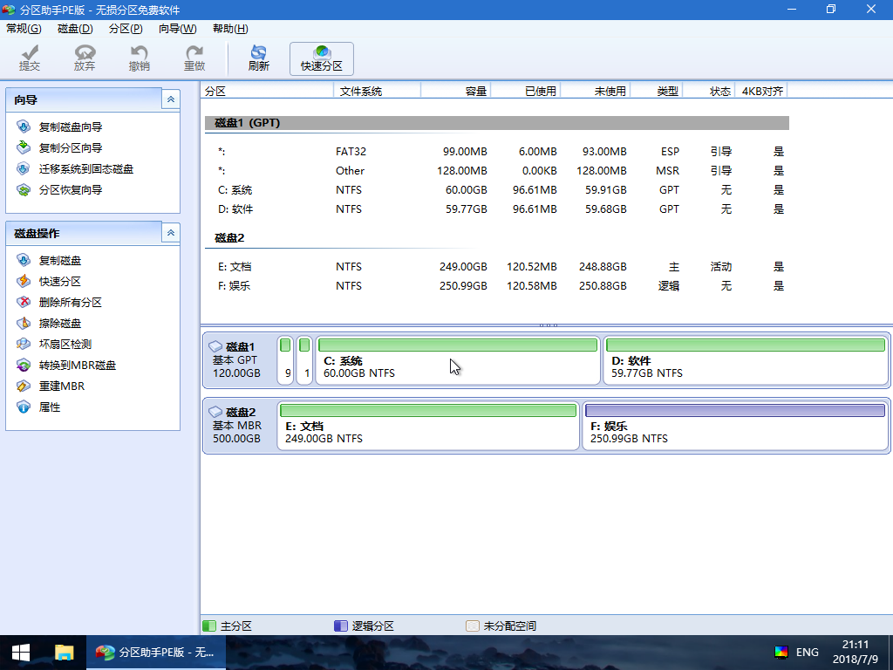

<<<<<<< HEAD
# window重装系统教程

## 准备工具

- 大于等于8G的u盘
- pe工具软件, 这里使用[微pe工具箱](http://down-ww3.newasp.net/pcdown/soft/soft1/wepe_64.exe)
- win10系统, 这里使用[win10 1903], 需要使用迅雷下载, 下载链接-`ed2k://|file|cn_windows_10_consumer_editions_version_1903_updated_aug_2019_x64_dvd_4c9cbf0b.iso|5306406912|D061699FE76029369A7BEC3622A564BA|/`

## 制作u盘启动器

0. 对u盘里面的数据进行备份, 制作u盘启动器将清空u盘内容

   

1. 打开软件，插入U盘，看到如下界面，微PE支持安装到电脑、U盘、移动硬盘，还可以制作成ISO文件，直接点击上图中的图标选项即可，接下来我们演示制作PE维护U盘，点击右下角第1个图标。




2. 进入安装PE到U盘选项，这里有七中安装方法，可以根据自己的需要选择，一般我们选择方案一即可，如果制作之后无法启动，再选择其他方案尝试。格式化旁边是U盘的分区格式，共三种，建议选择exFAT，这种格式是最适合U盘的，但是要注意exFAT格式在XP系统下是无法识别的。如果是新手，全部选择默认，不做改动即可。

   

3. 设置完成点击立即安装进U盘，就开始制作了


4. 制作过程稍作等待，大概需要一两分钟的时间，当弹出安装完成的提示时，我们的微PE系统维护U盘就制作完成了。需要注意的是在安装38%或55%到时会卡一段较长时间，如果你电脑已经购买超5年会一直卡在某个进度，建议换个USB插口或电脑刻录PE系统。


5. 将下载好的系统复制到u盘中

## 格式化硬盘和分区

1. 电脑关机然后启动的时候按相应的按键进入bios, 选择当前插入的u盘启动

2. 进入u盘系统以后进入桌面软件:分区助手PE版

   

3. 删除非固态硬盘所在盘的小分区, 最后记得点击软件左上角的提交按钮完成操作

4. 按键盘上面的win+r键, 在出现的输入框中输入'cmd'命令, 出现黑色命令行窗口

5. 输入以下命令:

   ```
   diskpart
   list disk
   //找到固态硬盘所在盘的编号（0或者1）
   ```

6. 接第5步对固态硬盘进行分区操作

   ```
   //找到固态硬盘所在盘的编号（0或者1）, 下面的0或1根据硬盘编号选择
   select disk 0
   clean
   convert gpt
   //efi
   create partition efi size=300
   format quick fs=fat32 label="efi"
   assign letter="S"
   //msr
   create partition msr size=128
   ```

7. 再次回到分区助手PE版对固态硬盘剩余分区进行分区, 建议分成两个相等的分区

## 安装系统

1. 回到桌面, 进入:Windows安装器
2. 最上面的框选择window系统install.wim所在路径
3. 中间的引导器框选择"S"盘
4. 最下面安装位置选择最后所分区里面的其中一个区
5. 观察引导器框右边的灯是否都是绿色, 如果是则点击右下角开始安装按钮进行系统安装, 当进去条满时会会出现一个弹框说安装成功则代表完成安装
=======
# window重装系统教程

## 准备工具

- 大于等于8G的u盘
- pe工具软件, 这里使用[微pe工具箱](https://dl.pconline.com.cn/download/359800-1.html/)
- win10系统, 这里使用[win10 20H2], 需要使用迅雷下载, 下载链接-`ed2k://|file|cn_windows_10_business_editions_version_20h2_updated_jan_2021_x64_dvd_b6eb1ee6.iso|6025357312|59B9788D4AA91EA4DA6FB25711CAC8C8|/`

## 制作u盘启动器

0. 对u盘里面的数据进行备份, 制作u盘启动器将清空u盘内容

   

1. 打开软件，插入U盘，看到如下界面，微PE支持安装到电脑、U盘、移动硬盘，还可以制作成ISO文件，直接点击上图中的图标选项即可，接下来我们演示制作PE维护U盘，点击右下角第1个图标。


2. 进入安装PE到U盘选项，这里有七中安装方法，可以根据自己的需要选择，一般我们选择方案一即可，如果制作之后无法启动，再选择其他方案尝试。格式化旁边是U盘的分区格式，共三种，建议选择exFAT，这种格式是最适合U盘的，但是要注意exFAT格式在XP系统下是无法识别的。如果是新手，全部选择默认，不做改动即可。

   

3. 设置完成点击立即安装进U盘，就开始制作了


4. 制作过程稍作等待，大概需要一两分钟的时间，当弹出安装完成的提示时，我们的微PE系统维护U盘就制作完成了。需要注意的是在安装38%或55%到时会卡一段较长时间，如果你电脑已经购买超5年会一直卡在某个进度，建议换个USB插口或电脑刻录PE系统。


5. 将下载好的系统复制到u盘中

## 格式化硬盘和分区

1. 电脑关机然后启动的时候按相应的按键进入bios, 选择当前插入的u盘启动

2. 进入u盘系统以后进入桌面软件:分区助手PE版

   

3. 删除非固态硬盘所在盘的小分区, 最后记得点击软件左上角的提交按钮完成操作

4. 按键盘上面的win+r键, 在出现的输入框中输入'cmd'命令, 出现黑色命令行窗口

5. 输入以下命令:

   ```
   diskpart
   list disk
   //找到固态硬盘所在盘的编号（0或者1）
   ```

6. 接第5步对固态硬盘进行分区操作

   ```
   //找到固态硬盘所在盘的编号（0或者1）, 下面的0或1根据硬盘编号选择
   select disk 0
   clean
   convert gpt
   //efi
   create partition efi size=300
   format quick fs=fat32 label="efi"
   assign letter="S"
   //msr
   create partition msr size=128
   ```

7. 再次回到分区助手PE版对固态硬盘剩余分区进行分区, 建议分成两个相等的分区

## 安装系统

1. 回到桌面, 进入:Windows安装器
2. 最上面的框选择window系统install.wim所在路径
3. 中间的引导器框选择"S"盘
4. 最下面安装位置选择最后所分区里面的其中一个区
5. 观察引导器框右边的灯是否都是绿色, 如果是则点击右下角开始安装按钮进行系统安装, 当进去条满时会会出现一个弹框说安装成功则代表完成安装
>>>>>>> 0a57934a1ef9fc0ad09da39d45d2bc74354cf093
6. 点击电脑右下角window安装找到重启选择重启电脑, 拔掉u盘, 让电脑自动进入新系统