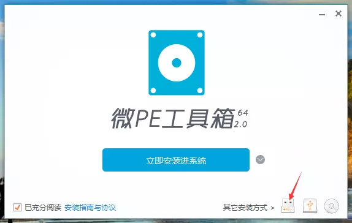
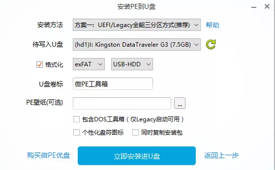

# window系统更新

## 方法一

1. 下载win10系统, 这里使用[win10 20H2], 需要使用迅雷下载, 下载链接-`ed2k://|file|cn_windows_10_business_editions_version_20h2_updated_jan_2021_x64_dvd_b6eb1ee6.iso|6025357312|59B9788D4AA91EA4DA6FB25711CAC8C8|/`
2. 找到下载的文件，双击打开，找到setup.exew文件，然后点击按照选项取更新系统

## 方法二

### 准备工具

- 大于等于8G的u盘
- pe工具软件, 这里使用[微pe工具箱](https://dl.pconline.com.cn/download/359800-1.html/)
- win10系统, 这里使用[win10 20H2], 需要使用迅雷下载, 下载链接-`ed2k://|file|cn_windows_10_business_editions_version_20h2_updated_jan_2021_x64_dvd_b6eb1ee6.iso|6025357312|59B9788D4AA91EA4DA6FB25711CAC8C8|/`

### 制作u盘启动器

0. 对u盘里面的数据进行备份, 制作u盘启动器将清空u盘内容

   

1. 打开软件，插入U盘，看到如下界面，微PE支持安装到电脑、U盘、移动硬盘，还可以制作成ISO文件，直接点击上图中的图标选项即可，接下来我们演示制作PE维护U盘，点击右下角第1个图标。

2. 进入安装PE到U盘选项，这里有七中安装方法，可以根据自己的需要选择，一般我们选择方案一即可，如果制作之后无法启动，再选择其他方案尝试。格式化旁边是U盘的分区格式，共三种，建议选择exFAT，这种格式是最适合U盘的，但是要注意exFAT格式在XP系统下是无法识别的。如果是新手，全部选择默认，不做改动即可。

   

3. 设置完成点击立即安装进U盘，就开始制作了

4. 制作过程稍作等待，大概需要一两分钟的时间，当弹出安装完成的提示时，我们的微PE系统维护U盘就制作完成了。需要注意的是在安装38%或55%到时会卡一段较长时间，如果你电脑已经购买超5年会一直卡在某个进度，建议换个USB插口或电脑刻录PE系统。

5. 将下载好的系统复制到u盘中
6. 通过电脑bios进入u盘
7. 找到下载的文件，双击打开，找到setup.exew文件，然后点击按照选项取更新系统
